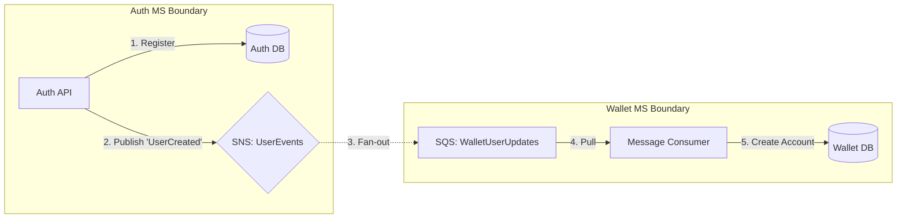
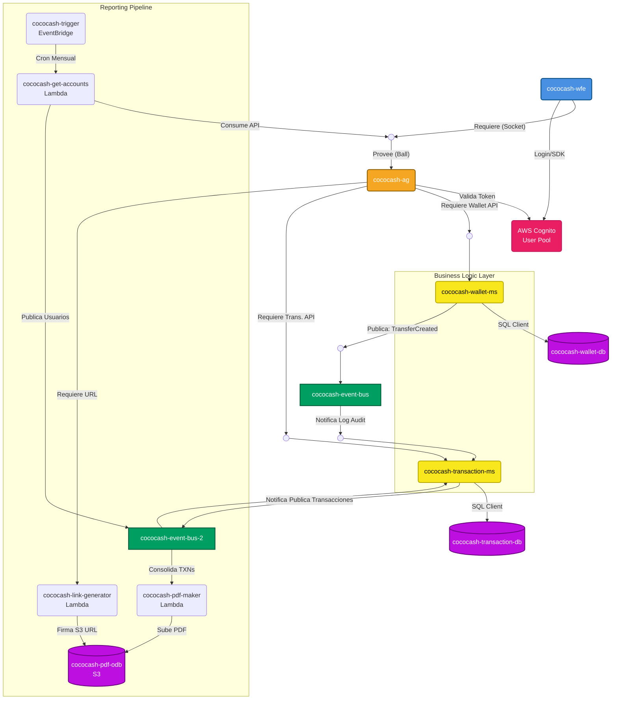

# Arquitectura de Microservicios CocoCash

Este documento describe la estrategia de arquitectura para escalar el sistema agregando nuevos microservicios.

## 1. Estrategia de Módulos (Terraform)

Para agregar nuevos microservicios (ej. `auth-ms`, `notifications-ms`), seguimos el patrón de **Módulos Independientes**.

### Estructura de Directorios Propuesta

```
cococash/
├── main.tf                   # "Director de Orquesta" - Conecta los módulos
├── cococash-infra/           # Red compartida (VPC, Subnets) - CAPA COMÚN
├── cococash-wallet-ms/       # Microservicio Wallet
│   └── infra/                # Recursos propios (RDS, EC2, SQS)
└── cococash-auth-ms/         # [NUEVO] Microservicio Auth
    ├── src/                  # Código Auth
    └── infra/                # Recursos Auth (Cognito/RDS, Lambda/EC2, SNS)
```

### Cómo agregar un nuevo MS

1. Crear la carpeta `cococash-auth-ms/infra`.
2. Definir sus recursos en `cococash-auth-ms/infra/main.tf` (ej. un SNS Topic `user-events`).
3. En el `main.tf` raíz, agregar el módulo:

```hcl
# main.tf raíz

# Infraestructura Base (Red)
module "networking" {
  source = "./cococash-infra"
}

# Módulo Auth (Productor de eventos)
module "auth" {
  source = "./cococash-auth-ms/infra"
  vpc_id = module.networking.vpc_id
}

# Módulo Wallet (Consumidor de eventos)
module "wallet" {
  source = "./cococash-wallet-ms/infra"
  
  vpc_id = module.networking.vpc_id
  
  # Inyección de dependencia de eventos
  auth_sns_topic_arn = module.auth.user_events_topic_arn
}
```

---

## 2. Comunicación entre Microservicios (Event-Driven)

Para conectar Auth con Wallet (ej. "Solo crear wallet si el usuario se registró"), usamos el patrón **Pub/Sub**. ¡No se llaman directamente por HTTP!

### Flujo: Registro de Usuario

1. **Auth MS** (Productor): Registra usuario y publica evento `UserCreated` en su SNS Topic.
2. **Wallet MS** (Consumidor): Tiene una SQS Queue suscrita a ese SNS Topic.
3. **Procesamiento**: Wallet MS lee el mensaje de su cola y crea la cuenta automáticamente.

### Diagrama de Flujo



## 3. Seguridad y Autenticación (Síncrono)

Para requisitos como *"realizar transacciones solo si está logueado"*, no usamos eventos, sino **Validación de Tokens (JWT)**.

1. **Auth MS**: Emite un Token JWT compatible con OIDC (OpenID Connect) al hacer login.
2. **Frontend**: Envía el token en el header `Authorization: Bearer <token>`.
3. **Wallet MS**:
   *   No llama a Auth MS en cada request (sería lento).
   *   Verifica la **firma criptográfica** del JWT usando la clave pública de Auth MS.
   *   Extrae el `sub` (UserId) del token para asociar la transacción.

### Middleware de Autenticación (Ejemplo Conceptual)

```typescript
// wallet-ms/src/middleware/auth.ts
async function verifyToken(req, res, next) {
  const token = req.headers.authorization?.split(' ')[1];
  try {
    // Valida firma off-line (sin ir a Auth MS)
    const payload = await jwt.verify(token, AUTH_PUBLIC_KEY);
    req.user = { id: payload.sub }; // Usuario autenticado
    next();
  } catch (err) {
    res.status(401).json({ error: 'Unauthorized' });
  }
}
```

Esquema híbrido:
*   **Eventos (SNS/SQS)**: Para cosas que pasan *después* (ej. "Usuario Creado" -> "Crear Billetera").
*   **Tokens (JWT)**: Para permisos en tiempo real (ej. "Puedo transferir?").


### Beneficios
*   **Desacoplamiento**: Si Wallet se cae, Auth sigue funcionando. Los mensajes se guardan en la SQS.
*   **Escalabilidad**: Podemos agregar más consumidores (ej. `Email MS` para bienvenida) al mismo SNS sin tocar Auth.


## 4. Arquitectura Híbrida: ¿Cuándo usar qué?

Tienes toda la razón: **No todo necesita ser orientado a eventos**. De hecho, abusar de eventos para todo puede complicar innecesariamente el sistema (Event Chaos).

Tu diagrama con `API Gateway` -> `Microservicios` (REST) es **totalmente válido y necesario** para la mayoría de las interacciones de usuario.

### Estrategia Recomendada: "Core Síncrono, Side-Effects Asíncronos"

#### A. Flujo Síncrono (REST / HTTP) - "El Usuario Espera"
*   **Cuándo**: El usuario necesita una respuesta inmediata (Login, Ver Saldo, Iniciar Transferencia).
*   **Componentes**: `App` -> `API Gateway` -> `Wallet MS` -> `DB`.
*   **Por qué**: Es simple, fácil de depurar y el usuario sabe si falló al instante.
*   **Ejemplo**: `POST /transfer`. El `Wallet MS` valida fondos, crea el registro en BD y responde `200 OK`.

#### B. Flujo Asíncrono (Eventos) - "El Usuario Ya Se Fue"
*   **Cuándo**: Tareas secundarias que no deben hacer esperar al usuario (Enviar Email, Calcular Fraude, Actualizar Analytics).
*   **Componentes**: `Wallet MS` -> `SNS` -> `SQS` -> `Notification MS`.
*   **Por qué**: Desacopla sistemas. Si el sistema de correos está caído, la transferencia SÍ se hace, y el correo se envía después.

### Tu Diagrama vs. Realidad

Tu diagrama de componentes (`WFE` -> `AG` -> `MS`) representa el **Camino Crítico (Path A)**.
Los eventos (SNS/SQS) son la "capa invisible" que conecta los servicios por detrás para el **Path B**.

**Resumen:**
2.  Usa Eventos solo para comunicación **Horizontal** (Backend -> Backend) cuando no necesites respuesta inmediata.


### Diagrama de Componentes C&C (Híbrido)



## 6. Análisis de Cobertura de Requerimientos (RF)

Basado en tu flujo y diagrama, así es como cumplimos los requerimientos funcionales:

### A. Gestión de Identidad (RF-01, RF-02, RF-03)
*   **Componentes**: `cococash-wfe` -> `AWS Cognito`.
*   **Flujo**: El usuario se registra y loguea directamente contra Cognito usando el SDK.
*   **Cumplimiento**: ✅ Total. Cognito maneja el hashing, almacenamiento y JWT de forma segura (SaaS).

### B. Billetera y Saldos (RF-04, RF-05, RF-06)
*   **Componentes**: `cococash-wallet-ms` -> `cococash-wallet-db`.
*   **Flujo**: Creación de cuenta y consulta de saldo (`GET /balance`).
*   **Cumplimiento**: ✅ Total. `wallet-db` mantiene el estado "simulado" del dinero.

### C. Transferencias (RF-07, RF-08, RF-10, RF-11)
*   **Componentes**: `cococash-wfe` -> `cococash-ag` -> `cococash-wallet-ms`.
*   **Flujo**:
    1.  `POST /transfer` llega al Wallet MS.
    2.  Wallet MS valida saldo y destino (Síncrono).
    3.  Wallet MS actualiza saldos en `wallet-db` (Atomicidad/Consistencia para RF-10).
    4.  Retorna "OK" al usuario.
*   **Cumplimiento**: ✅ Total. La lógica transaccional crítica se mantiene dentro del dominio de Wallet.

### D. Auditoría Asíncrona (RF-09, RF-12, RF-13, RF-14, RF-17)
*   **Componentes**: `cococash-wallet-ms` -> `cococash-event-bus` -> `cococash-transaction-ms` -> `cococash-transaction-db`.
*   **Flujo**:
    1.  Tras el éxito en (C), Wallet MS publica `TransferCreated` al bus.
    2.  `transaction-ms` consume este evento.
    3.  Guarda el registro inmutable en `transaction-db`.
    4.  El usuario puede consultar historial (`GET /transactions`) vía AG -> `transaction-ms`.
*   **Cumplimiento**: ✅ Total.
    *   **RF-09**: El procesamiento de *registro* es asíncrono.
    *   **RF-12**: Transaction MS es la fuente de la verdad inmutable.
    *   **RF-13**: Transaction MS expone la API de consulta de historial.

### Interpretación Componente-Conector (Punto vs Arco)

En el diagrama:
1.  **Bola (Punto)**: Representa la **Interfaz Provista** (El que dice "Aquí estoy, llámame").
    *   Ejemplo: `AWS Cognito` provee la interfaz de Auth.
2.  **Copa (Arco)**: Representa la **Interfaz Requerida** (El que dice "Necesito tal servicio").
    *   Ejemplo: `cococash-ag` requiere validar tokens con Cognito.

## 7. Catálogo de Elementos (Descripción y Tecnologías)

A continuación se detalla cada componente del diagrama C&C, sus responsabilidades específicas y la tecnología recomendada para su implementación en AWS.

### A. Capa de Presentación (Frontend)

| Componente | Responsabilidad | Tecnología Sugerida |
| :--- | :--- | :--- |
| **`cococash-wfe`** <br> (Web Front End) | **Interfaz de Usuario (UI)**: Provee la experiencia visual para el usuario final.<br>**Cliente API**: Consume los servicios a través del API Gateway.<br>**Gestión de Estado**: Mantiene la sesión del usuario (Token JWT). | **Framework**: React.js / Next.js (SPA)<br>**Hosting**: AWS EC2 (Next.js Server).<br>**Lenguaje**: TypeScript. |

### B. Capa de Orquestación (Gateway)

| Componente | Responsabilidad | Tecnología Sugerida |
| :--- | :--- | :--- |
| **`cococash-ag`** <br> (API Gateway) | **Punto de Entrada Único**: Enruta el tráfico externo hacia los microservicios internos.<br>**Seguridad Perimetral**: Valida el JWT contra Cognito antes de pasar la petición (`Authorizer`). | **Servicio**: Amazon API Gateway (Managed).<br>**Protocolo**: REST (HTTP/1.1) sobre TLS. |

### C. Gestión de Identidad (SaaS)

| Componente | Responsabilidad | Tecnología Sugerida |
| :--- | :--- | :--- |
| **`AWS Cognito`** | **Auth as a Service**: Registro, Login, MFA, Recuperación de Password.<br>**Token Provider**: Emite Access Tokens y ID Tokens (OIDC).<br>**User Directory**: Almacena perfiles de forma segura (reemplaza `auth-db`). | **Servicio**: AWS Cognito User Pool.<br>**Gestión**: Vía Consola AWS o Terraform. |

### D. Capa de Lógica de Negocio (Microservicios)

Todos los microservicios siguen la arquitectura **Shared-Nothing** (sin compartir BD) y son desplegados en contenedores.

| Componente | Responsabilidad | Tecnología Sugerida |
| :--- | :--- | :--- |
| **`cococash-wallet-ms`** | **Core Bancario**: Gestión de saldos y cuentas (RF-04, RF-05).<br>**Transacciones**: Lógica de transferencia y validación de fondos (RF-07, RF-08).<br>**Event Publisher**: Notifica cuando ocurre una transferencia. | **Runtime**: Node.js (TypeScript).<br>**Compute**: AWS ECS Fargate.<br>**Observabilidad**: AWS CloudWatch. |
| **`cococash-transaction-ms`** | **Auditoría**: Bitácora inmutable de operaciones (RF-12, RF-17).<br>**Historial**: Consulta de movimientos pasados (RF-13).<br>**Event Consumer**: Escucha eventos del Wallet para persistir la data. | **Runtime**: Go.<br>**Compute**: AWS ECS Fargate (SQS Worker).<br>**Pattern**: Event Sourcing (Lite). |

### E. Capa de Persistencia (Datos)

| Componente | Responsabilidad | Tecnología Sugerida |
| :--- | :--- | :--- |
| **`wallet-db`** | Persistencia de saldos actuales (Estado actual). Alta consistencia requerida (ACID). | **Motor**: PostgreSQL (AWS RDS).<br>**Modelo**: Relacional estricto. |
| **`transaction-db`** | Persistencia histórica de transacciones (Append-only). | **Motor**: Amazon DynamoDB (On-Demand).<br>**Partition Key**: `user_id`<br>**Sort Key**: `timestamp`. |

### E. Capa de Eventos (Asíncrona)

| Componente | Responsabilidad | Tecnología Sugerida |
| :--- | :--- | :--- |
| **`cococash-event-bus`** | **Core Asíncrono**: Desacopla Wallet de Transaction (`transfer.completed`). | **Servicios**: Amazon SNS + Amazon SQS (con DLQ). |
| **`cococash-event-bus-2`** | **Reporting Pipeline**: Gestiona el flujo batch mensual compuesto por dos tópicos SNS separados: uno para encolar lotes de usuarios y otro para enviar el historial de transacciones a la generación de PDF. | **Servicios**: Amazon SNS + Amazon SQS. |

### F. Subsistema de Batch y Reportes (Serverless)

| Componente | Responsabilidad | Tecnología Sugerida |
| :--- | :--- | :--- |
| **`cococash-trigger`** | **Scheduler**: Activa el flujo de reportes el día 1 de cada mes. | **Servicio**: Amazon EventBridge. |
| **`cococash-get-accounts`** | **Orquestador Batch**: Obtiene lista de usuarios del API Gateway y publica lotes a `event-bus-2`. | **Runtime**: Go (AWS Lambda). |
| **`cococash-pdf-maker`** | **Renderizado Documental**: Consume historial del `event-bus-2`, genera PDF y sube a S3. | **Runtime**: Go (AWS Lambda). |
| **`cococash-link-generator`** | **Proxy de Seguridad S3**: Genera URLs S3 prefirmadas temporales para descargas de usuario. Invocado síncronamente vía API Gateway. | **Runtime**: Go (AWS Lambda). |
| **`cococash-pdf-odb`** | **Almacenamiento Objeto**: Retención inmutable de los extractos generados. | **Servicio**: Amazon S3 (Privado). |## 8. Vista de Despliegue Objetivo (AWS Well-Architected)

Esta arquitectura sigue las mejores prácticas de **AWS Well-Architected Framework**, utilizando una mezcla óptima de **Servicios Gestionados (Serverless)** y **Contenedores/EC2** en una topología Multi-AZ.

### Diagrama de Infraestructura AWS (Multi-AZ)

```mermaid
graph TD
    %% Estilos AWS
    classDef aws fill:#FF9900,stroke:#232F3E,stroke-width:2px,color:white;
    classDef vpc fill:#F2F3F3,stroke:#232F3E,stroke-width:2px,stroke-dasharray: 5 5,color:#232F3E;
    classDef public fill:#E7F2FA,stroke:#007DBC,stroke-width:2px,color:#007DBC;
    classDef private fill:#E6F6E6,stroke:#1D8102,stroke-width:2px,color:#1D8102;
    classDef compute fill:#D94C3D,stroke:#8C251C,stroke-width:2px,color:white;
    classDef data fill:#3B48CC,stroke:#1F2666,stroke-width:2px,color:white;
    classDef auth fill:#E91E63,stroke:#C2185B,stroke-width:2px,color:white;
    
    %% --- REGIONAL SERVICES ---
    subgraph Region ["☁️ AWS Region (us-east/us-east-1)"]
        direction TB
        
        ALB(Application Load Balancer):::aws
        APIGW(Amazon API Gateway):::aws
        COGNITO(Amazon Cognito):::auth
        DYNAMO(Amazon DynamoDB Table: <br> AuditLog):::data

        %% --- VPC ---
        subgraph VPC ["VPC (Multi-AZ)"]
            direction TB
            
            %% VPC Endpoints
            VPCE_DDB(VPC Endpoint: DynamoDB):::aws

            %% AZ 1
            subgraph AZ1 ["🏢 Availability Zone 1 (us-east-1a)"]
                
                %% 1. Ingress & Frontend
                subgraph Pub1 ["🔓 Public Subnet 1"]
                    WFE_1[📦 AWS Fargate: <br> cococash-wfe (Next.js)]:::compute
                end
                
                %% 2. Backend Logic & Async
                subgraph Priv1 ["🔒 Private Subnet 1 (App)"]
                    WALLET_1[🖥️ Amazon EC2: <br> cococash-wallet-ms]:::compute
                    TRANS_1[📦 AWS Fargate (Worker): <br> cococash-trans-ms]:::compute
                    
                    SNS_1{{Amazon SNS}}:::aws
                    SQS_1(Amazon SQS):::aws
                end
                
                %% 3. Persistence
                subgraph Data1 ["🛡️ Private Subnet 3 (Data)"]
                    RDS_1[(Amazon RDS: Primary <br> WalletDB)]:::data
                end
            end

            %% AZ 2 (Redundancy)
            subgraph AZ2 ["🏢 Availability Zone 2 (us-east-1b)"]
                
                subgraph Pub2 ["🔓 Public Subnet 1"]
                    WFE_2[📦 AWS Fargate: <br> cococash-wfe (Next.js)]:::compute
                end
                
                subgraph Priv2 ["🔒 Private Subnet 1 (App)"]
                    WALLET_2[🖥️ Amazon EC2: <br> cococash-wallet-ms]:::compute
                    TRANS_2[📦 AWS Fargate (Worker): <br> cococash-trans-ms]:::compute
                end
                
                subgraph Data2 ["🛡️ Private Subnet 3 (Data)"]
                    RDS_2[(Amazon RDS: Standby)]:::data
                end
            end
        end
    end

    %% --- CONEXIONES ---
    
    %% Ingress Flow
    ALB -- "HTTPS (443)" --> WFE_1 & WFE_2
    WFE_1 & WFE_2 -- "Auth SDK" --> COGNITO
    WFE_1 & WFE_2 -- "API Calls" --> APIGW
    
    %% API Routing
    APIGW -- "Validate Token" --> COGNITO
    APIGW -- "REST" --> WALLET_1 & WALLET_2
    
    %% Reporting Pipeline (Serverless)
    APIGW -- "REST /reports" --> LINK_GEN(Lambda: Link Generator):::compute
    EVENT(EventBridge: Cron 1st Month):::aws --> GET_ACC(Lambda: Get Accounts):::compute
    GET_ACC -.->|Límites HTTP| APIGW
    GET_ACC -.->|Publica Lote Usuarios| SNS_REP1{{SNS: Report Users}}:::aws
    SNS_REP1 -.-> SQS_REP1(SQS: Users)
    SQS_REP1 -.->|Consume| TRANS_1 & TRANS_2
    TRANS_1 & TRANS_2 -.->|Publica TXNs| SNS_REP2{{SNS: Report TXNs}}:::aws
    SNS_REP2 -.-> SQS_REP2(SQS: TXNs)
    SQS_REP2 -.->|Genera PDF| PDF_MAKER(Lambda: PDF Maker):::compute
    
    %% Storage S3
    S3[(Amazon S3: ODB)]:::data
    PDF_MAKER -- "Sube PDF (PutObject)" --> S3
    LINK_GEN -- "Firma URL (GetObject)" --> S3
    WFE_1 & WFE_2 -- "Descarga vía URL Firmada" --> S3
    
    %% Event Driven Flow (Decoupling Core)
    WALLET_1 & WALLET_2 -.->|Publish| SNS_1
    SNS_1 -.->|Fan-out| SQS_1
    SQS_1 -.->|Consume| TRANS_1 & TRANS_2
    
    %% Persistence - WALLET (SQL)
    WALLET_1 & WALLET_2 -- "SQL (TCP 5432)" --> RDS_1
    RDS_1 -.->|Sync Replication| RDS_2
    
    %% Persistence - TRANSACTION (NoSQL)
    TRANS_1 & TRANS_2 -- "HTTPS (Via VPCE)" --> VPCE_DDB --> DYNAMO
```

### Descripción Detallada por Capas (AWS Best Practices)

| Capa | Componente | Descripción y Justificación |
| :--- | :--- | :--- |
| **Ingress & Seguridad** | **ALB + Cognito + API GW** | **Punto de Entrada Unificado.** El `ALB` balancea la carga del Frontend. `Amazon Cognito` protege la identidad antes de llegar a la lógica. `API Gateway` gestiona las rutas y protege los microservicios internos. |
| **Frontend (Compute)** | **AWS Fargate (Public)** | **Contenedores Serverless.** Ejecuta el servidor Next.js. Al estar en la *Public Subnet*, tiene visibilidad controlada hacia internet (vía ALB). |
| **Backend (Compute)** | **Amazon EC2 (Private)** | **Instancias Dedicadas.** Aloja `cococash-wallet-ms`. |
| **Workers (Async)** | **AWS Fargate (Private)** | **Procesamiento de Cola.** Aloja `cococash-trans-ms`. Escala automáticamente basado en la profundidad de la cola SQS. |
| **Mensajería** | **SNS + SQS** | **Core Asíncrono.** `SNS` recibe eventos de Wallet y Reportes. Las DLQ (Dead Letter Queues) asumen los errores y reintentan el encolamiento sin pérdida. |
| **Reporting (Serverless)**| **EventBridge + Lambdas** | Flujo 100% Serverless en Go. Reducción máxima del timeout con lotes de 100 peticiones desde `get-accounts`. `pdf-maker` genera los reportes, e interacciones Síncronas desde `cococash-wfe` hacia `link-generator` resuelven URLs temporales para interactuar directamente entre el navegador y AWS S3. |
| **Persistencia (Wallet)** | **Amazon RDS** | **Aislamiento de Datos.** Multi-AZ para alta disponibilidad: si la zona `us-east-1a` cae, la base de datos conmuta automáticamente. |
| **Data Lake / ODB** | **Amazon S3** | **Almacenamiento Estático Escalable** Archivos PDF protegidos tras políticas criptográficas, sin indexación pública o lectura descubierta. |

## 9. Análisis de Seguridad y Conectividad (Security Groups)

Para implementar la arquitectura de manera segura ("Zero Trust Network"), definimos reglas estrictas de **Security Groups (SG)**.

### Definición de Security Groups

| Security Group | Asociado a | Inbound Rules (Entrada Permitida) | Outbound Rules (Salida) | Justificación |
| :--- | :--- | :--- | :--- | :--- |
| **`sg-alb-public`** | **ALB (Público)** | **HTTPS (443)** desde `0.0.0.0/0` (Internet). | Todo hacia `sg-frontend`. | Único punto de entrada público. |
| **`sg-frontend`** | **Fargate (WFE)** | **HTTP (3000)** solo desde `sg-alb-public`. | Todo (para llamar a Cognito/API GW). | El frontend solo recibe tráfico del balanceador. |
| **`sg-wallet-app`** | **EC2 (Wallet MS)** | **HTTP (3000/8080)** desde `VPC Link / NLB` (API Gateway Privado).<br>**SSH (22)** solo desde `Bastion Host` (VPN). | Todo (para SNS y RDS). | Aislado en subnet privada. API GW accede vía integración privada. |
| **`sg-trans-worker`** | **Fargate (Worker)** | **Ninguna**. (No recibe peticiones, solo consume SQS). | Todo (para RDS y SQS). | Los workers son iniciados por eventos, no escuchan puertos. |
| **`sg-rpc-wallet`** | **RDS (Postgres)** | **TCP (5432)** solo desde `sg-wallet-app`. | Ninguna. | **Aislamiento Total**. Solo Wallet MS puede escribir en su DB. |
| **`sg-vpc-endpoint`** | **VPC Endpoints** | **HTTPS (443)** desde `sg-wallet-app` y `sg-trans-worker`. | - | Permite acceso privado a servicios AWS (DynamoDB, SQS, SNS) sin salir a internet. |

### Estrategia de Replicación y Persistencia (Split Stack)

Has tomado la decisión correcta al separar las bases de datos:

1.  **Wallet DB (PostgreSQL en RDS)**:
    *   **¿Por qué RDS?**: Necesitas transacciones ACID fuertes para gestionar dinero ("Si resto aquí, sumo allá").
    *   **Replicación**: Se usa **Multi-AZ (Synchronous Standby)**. Esto significa que cada escritura se copia *antes* de confirmar al cliente. Si la zona A muere, la zona B toma el control en segundos sin pérdida de datos. **Correcto para sistemas críticos.**

2.  **Audit Log (DynamoDB)**:
    *   **¿Por qué DynamoDB?**: Necesitas escribir logs rápido y escalar infinitamente. No requieres JOINs complejos.
    *   **Replicación**: DynamoDB es **Regional por defecto** (Multi-AZ nativo). Tus datos se copian automáticamente en 3 zonas.
    *   **Global Tables**: Solo necesitarías "Global Tables" si quisieras replicar datos a otra región (ej. `us-west-2` para Disaster Recovery geográfico). Para HA dentro de `us-east`, la configuración estándar es suficiente y muy robusta.

3.  **Conexión Correcta a DynamoDB**:
    *   Usa siempre un **VPC Endpoint de tipo Gateway** para DynamoDB.
    *   Esto asegura que el tráfico (HTTPS) nunca salga a la internet pública, manteniéndose en la red interna de AWS, mejorando la latencia y la seguridad.


## 10. Especificaciones de la API (3.2.2)

Esta sección documenta todos los **endpoints públicos** expuestos a través de `cococash-ag` (API Gateway), organizados por servicio.

**Convenciones Generales:**

| Aspecto | Valor |
| :--- | :--- |
| **Base URL** | `https://api.cococash.app/v1` |
| **Formato** | JSON (`Content-Type: application/json`) |
| **Autenticación** | Bearer Token (JWT emitido por Cognito) en header `Authorization` |
| **Moneda** | `CCC` (CocoCash Coins) |
| **IDs** | UUID v4 |

**Estructura de Respuesta Estándar:**

```json
// Éxito
{
  "success": true,
  "data": { ... }
}

// Error
{
  "success": false,
  "error": {
    "code": "INSUFFICIENT_FUNDS",
    "message": "Saldo insuficiente para completar la transferencia."
  }
}
```

---

### 10.1 Servicio de Identidad (`cococash-auth-ms` → Amazon Cognito)

> **Nota**: Estos flujos son gestionados por el **SDK de Cognito** directamente desde el Frontend (`cococash-wfe`). No pasan por el API Gateway.

#### `AUTH-01` Registro de Usuario

| Campo | Valor |
| :--- | :--- |
| **Operación** | `signUp` (Cognito SDK) |
| **RF** | RF-01 |
| **Auth** | 🔓 Pública |

**Request (SDK):**
```json
{
  "username": "usuario@email.com",
  "password": "P@ssw0rd!Seguro",
  "attributes": {
    "email": "usuario@email.com",
    "name": "Juan Pérez",
    "phone_number": "+573001234567"
  }
}
```

**Response (SDK):**
```json
{
  "userSub": "a1b2c3d4-e5f6-7890-abcd-ef1234567890",
  "userConfirmed": false,
  "codeDeliveryDetails": {
    "destination": "u***@email.com",
    "deliveryMedium": "EMAIL"
  }
}
```

| Escenario | Resultado |
| :--- | :--- |
| ✅ Registro exitoso | `userSub` (UUID) + código de confirmación enviado. |
| ❌ Email duplicado | `UsernameExistsException` |
| ❌ Password débil | `InvalidPasswordException` |

---

#### `AUTH-02` Inicio de Sesión (Login)

| Campo | Valor |
| :--- | :--- |
| **Operación** | `initiateAuth` (Cognito SDK) |
| **RF** | RF-02 |
| **Auth** | 🔓 Pública |

**Request (SDK):**
```json
{
  "authFlow": "USER_PASSWORD_AUTH",
  "authParameters": {
    "USERNAME": "usuario@email.com",
    "PASSWORD": "P@ssw0rd!Seguro"
  }
}
```

**Response (SDK):**
```json
{
  "AuthenticationResult": {
    "AccessToken": "eyJhbGciOiJSUzI1NiIs...",
    "IdToken": "eyJhbGciOiJSUzI1NiIs...",
    "RefreshToken": "eyJjdHkiOiJKV1QiLCJl...",
    "ExpiresIn": 3600,
    "TokenType": "Bearer"
  }
}
```

| Escenario | Resultado |
| :--- | :--- |
| ✅ Login exitoso | Tokens JWT (Access, ID, Refresh). |
| ❌ Credenciales inválidas | `NotAuthorizedException` |
| ❌ Usuario no confirmado | `UserNotConfirmedException` |

---

### 10.2 Servicio de Billetera (`cococash-wallet-ms`)

> Base Path: `/v1/accounts` y `/v1/transfers`
> Todos los endpoints requieren **🔒 Bearer Token** (validado por API Gateway + Cognito Authorizer).

---

#### `WALLET-01` Crear Cuenta de Billetera

| Campo | Valor |
| :--- | :--- |
| **Método** | `POST` |
| **Ruta** | `/v1/accounts` |
| **RF** | RF-04 |
| **Auth** | 🔒 Bearer Token |
| **Trigger** | Llamado internamente tras el registro en Cognito. |

**Request Body:**
```json
{
  "userId": "a1b2c3d4-e5f6-7890-abcd-ef1234567890",
  "initialBalance": 100.00
}
```

**Response `201 Created`:**
```json
{
  "success": true,
  "data": {
    "id": "f47ac10b-58cc-4372-a567-0e02b2c3d479",
    "userId": "a1b2c3d4-e5f6-7890-abcd-ef1234567890",
    "accountNumber": "1234567890",
    "balance": 100.00,
    "currency": "CCC",
    "status": "ACTIVE",
    "createdAt": "2026-02-15T20:00:00.000Z",
    "updatedAt": "2026-02-15T20:00:00.000Z"
  }
}
```

| Código | Escenario |
| :--- | :--- |
| `201` | Cuenta creada exitosamente. |
| `400` | `userId` faltante o inválido. |
| `409` | Ya existe una cuenta para ese `userId`. |

---

#### `WALLET-02` Consultar Saldo

| Campo | Valor |
| :--- | :--- |
| **Método** | `GET` |
| **Ruta** | `/v1/accounts/:accountId/balance` |
| **RF** | RF-06 |
| **Auth** | 🔒 Bearer Token |

**Response `200 OK`:**
```json
{
  "success": true,
  "data": {
    "accountId": "f47ac10b-58cc-4372-a567-0e02b2c3d479",
    "balance": 850.50,
    "currency": "CCC",
    "lastUpdated": "2026-02-15T20:30:00.000Z"
  }
}
```

| Código | Escenario |
| :--- | :--- |
| `200` | Saldo retornado. |
| `404` | Cuenta no encontrada. |

---

#### `WALLET-03` Obtener Cuenta por User ID

| Campo | Valor |
| :--- | :--- |
| **Método** | `GET` |
| **Ruta** | `/v1/accounts/user/:userId` |
| **RF** | RF-05 |
| **Auth** | 🔒 Bearer Token |

**Response `200 OK`:**
```json
{
  "success": true,
  "data": {
    "id": "f47ac10b-58cc-4372-a567-0e02b2c3d479",
    "userId": "a1b2c3d4-e5f6-7890-abcd-ef1234567890",
    "balance": 850.50,
    "currency": "CCC",
    "status": "ACTIVE",
    "createdAt": "2026-02-15T20:00:00.000Z",
    "updatedAt": "2026-02-15T20:30:00.000Z"
  }
}
```

| Código | Escenario |
| :--- | :--- |
| `200` | Cuenta encontrada. |
| `404` | No existe cuenta para ese `userId`. |

---

#### `WALLET-04` Iniciar Transferencia

| Campo | Valor |
| :--- | :--- |
| **Método** | `POST` |
| **Ruta** | `/v1/transfers` |
| **RF** | RF-07, RF-08, RF-10 |
| **Auth** | 🔒 Bearer Token |

**Request Body:**
```json
{
  "sourceAccountNumber": "1234567890",
  "destinationAccountNumber": "0987654321",
  "amount": 150.00,
  "description": "Pago almuerzo"
}
```

**Response `202 Accepted`:**
```json
{
  "success": true,
  "data": {
    "transferId": "d290f1ee-6c54-4b01-90e6-d701748f0851",
    "transferCode": "TRX-8A2B3C",
    "status": "PENDING",
    "message": "Transferencia iniciada. Procesamiento en curso."
  }
}
```

| Código | Escenario |
| :--- | :--- |
| `202` | Transferencia aceptada y en cola de procesamiento. |
| `400` | Campos faltantes o `amount <= 0`. |
| `404` | Cuenta origen o destino no encontrada. |
| `409` | Cuenta origen = cuenta destino. |
| `422` | Saldo insuficiente (`INSUFFICIENT_FUNDS`). |

> **Flujo Interno**: Wallet MS valida → actualiza saldos (ACID) → publica evento `TransferCreated` a SNS → retorna `202`.

---

#### `WALLET-05` Consultar Estado de Transferencia

| Campo | Valor |
| :--- | :--- |
| **Método** | `GET` |
| **Ruta** | `/v1/transfers/:transferId` |
| **RF** | RF-09 |
| **Auth** | 🔒 Bearer Token |

**Response `200 OK`:**
```json
{
  "success": true,
  "data": {
    "id": "d290f1ee-6c54-4b01-90e6-d701748f0851",
    "code": "TRX-8A2B3C",
    "sourceAccountId": "f47ac10b-58cc-4372-a567-0e02b2c3d479",
    "destinationAccountId": "b23dc20a-67dd-5483-b678-1f13c3d4e580",
    "amount": 150.00,
    "currency": "CCC",
    "status": "COMPLETED",
    "description": "Pago almuerzo",
    "createdAt": "2026-02-15T20:35:00.000Z",
    "processedAt": "2026-02-15T20:35:02.000Z",
    "failureReason": null
  }
}
```

| Código | Escenario |
| :--- | :--- |
| `200` | Estado de la transferencia retornado. |
| `404` | Transferencia no encontrada. |

**Estados posibles de `status`:**
| Status | Significado |
| :--- | :--- |
| `PENDING` | Recibida, aún no procesada. |
| `PROCESSING` | En proceso de validación y ejecución. |
| `COMPLETED` | Saldos actualizados exitosamente. |
| `FAILED` | Falló (ver `failureReason`). |

---

#### `WALLET-06` Historial de Transferencias por Cuenta

| Campo | Valor |
| :--- | :--- |
| **Método** | `GET` |
| **Ruta** | `/v1/transfers/account/:accountId` |
| **RF** | RF-13 |
| **Auth** | 🔒 Bearer Token |

**Response `200 OK`:**
```json
{
  "success": true,
  "data": [
    {
      "id": "d290f1ee-6c54-4b01-90e6-d701748f0851",
      "sourceAccountId": "f47ac10b-...",
      "destinationAccountId": "b23dc20a-...",
      "amount": 150.00,
      "currency": "CCC",
      "status": "COMPLETED",
      "description": "Pago almuerzo",
      "createdAt": "2026-02-15T20:35:00.000Z",
      "processedAt": "2026-02-15T20:35:02.000Z"
    }
  ]
}
```

---

### 10.3 Servicio de Transacciones / Auditoría (`cococash-transaction-ms`)

> Base Path: `/v1/transactions`
> Este servicio **consume eventos** de SQS (escritura) y **expone endpoints de lectura** vía API Gateway.

---

#### `TRANS-01` Consultar Historial de Auditoría (por Usuario)

| Campo | Valor |
| :--- | :--- |
| **Método** | `GET` |
| **Ruta** | `/v1/transactions/user/:userId` |
| **RF** | RF-12, RF-13 |
| **Auth** | 🔒 Bearer Token |
| **DB** | DynamoDB (Query por `partition_key = userId`) |

**Query Parameters:**

| Parámetro | Tipo | Requerido | Descripción |
| :--- | :--- | :--- | :--- |
| `limit` | `number` | No | Máximo de registros (default: 20, max: 100). |
| `startDate` | `ISO-8601` | No | Filtrar desde esta fecha. |
| `endDate` | `ISO-8601` | No | Filtrar hasta esta fecha. |

**Response `200 OK`:**
```json
{
  "success": true,
  "data": {
    "userId": "a1b2c3d4-e5f6-7890-abcd-ef1234567890",
    "transactions": [
      {
        "transactionId": "d290f1ee-6c54-4b01-90e6-d701748f0851",
        "type": "TRANSFER_SENT",
        "amount": 150.00,
        "currency": "CCC",
        "counterpartyAccountId": "b23dc20a-...",
        "description": "Pago almuerzo",
        "status": "COMPLETED",
        "timestamp": "2026-02-15T20:35:02.000Z"
      },
      {
        "transactionId": "e401g2ff-7d65-5c12-a1f7-e812859g1962",
        "type": "TRANSFER_RECEIVED",
        "amount": 500.00,
        "currency": "CCC",
        "counterpartyAccountId": "f47ac10b-...",
        "description": "Depósito inicial",
        "status": "COMPLETED",
        "timestamp": "2026-02-15T19:00:00.000Z"
      }
    ],
    "count": 2,
    "lastEvaluatedKey": null
  }
}
```

---

#### `TRANS-02` Consultar Detalle de Transacción

| Campo | Valor |
| :--- | :--- |
| **Método** | `GET` |
| **Ruta** | `/v1/transactions/:transactionId` |
| **RF** | RF-14 |
| **Auth** | 🔒 Bearer Token |

**Response `200 OK`:**
```json
{
  "success": true,
  "data": {
    "transactionId": "d290f1ee-6c54-4b01-90e6-d701748f0851",
    "transferId": "d290f1ee-6c54-4b01-90e6-d701748f0851",
    "sourceAccountId": "f47ac10b-...",
    "destinationAccountId": "b23dc20a-...",
    "amount": 150.00,
    "currency": "CCC",
    "status": "COMPLETED",
    "description": "Pago almuerzo",
    "createdAt": "2026-02-15T20:35:00.000Z",
    "processedAt": "2026-02-15T20:35:02.000Z",
    "auditTrail": {
      "eventSource": "cococash-wallet-ms",
      "eventType": "transfer.completed",
      "recordedAt": "2026-02-15T20:35:03.000Z"
    }
  }
}
```

---

#### 10.3.1 Nota Arquitectónica: ¿Y el POST? (Patrón CQRS)

Es posible que te preguntes: **¿Por qué no hay un `POST /transactions`?**

Esto se debe al patrón **CQRS (Command Query Responsibility Segregation)** y la naturaleza asíncrona del sistema:

1.  **Escritura (Command) - Interna y Asíncrona**:
    *   No exponemos un endpoint público para *crear* transacciones manualmente.
    *   Las transacciones son **efectos secundarios** de la operación de Billetera.
    *   **Flujo**: `Wallet MS` (Publica Evento) -> `SNS` -> `SQS` -> `Transaction MS` (Lambda Consumer).
    *   La Lambda de "Escritura" no tiene endpoint HTTP; es invocada automáticamente por AWS cuando llega un mensaje a la cola SQS.

2.  **Lectura (Query) - Pública y Síncrona**:
    *   Exponemos endpoints `GET` para auditoría.
    *   Estos endpoints sí activan una Lambda (o la misma función en modo lectura) vía API Gateway para leer de DynamoDB y responder al usuario.

**Resumen**:
*   **Lambda Consumer (Worker)**: Sin endpoint HTTP. Trigger: SQS.
*   **Lambda API (Reader)**: Con endpoint HTTP (`/v1/transactions/...`). Trigger: API Gateway.

---

### 10.4 Servicio de Accesos y Documentos (`cococash-link-generator`)

> Base Path: `/v1/reports`
> Este servicio interactúa con S3 para generar URLs firmadas.

---

#### `REPORT-01` Listar Meses Disponibles

| Campo | Valor |
| :--- | :--- |
| **Método** | `GET` |
| **Ruta** | `/v1/reports/:accountId` |
| **RF** | RF-17 |
| **Auth** | 🔒 Bearer Token |

**Response `200 OK`:**
```json
{
  "success": true,
  "data": {
    "reports": [
      {
        "period": "2026-03",
        "generatedAt": "2026-04-01T00:00:00.000Z",
        "downloadUrl": "https://api.cococash.app/v1/reports/f47ac10b.../download?period=2026-03"
      }
    ]
  }
}
```

---

#### `REPORT-02` Descargar Archivo PDF

| Campo | Valor |
| :--- | :--- |
| **Método** | `GET` |
| **Ruta** | `/v1/reports/:accountId/download` |
| **RF** | RF-17 |
| **Auth** | 🔒 Bearer Token |

**Query Parameters:**

| Parámetro | Tipo | Requerido | Descripción |
| :--- | :--- | :--- | :--- |
| `period` | `String` | Sí | Formato YYYY-MM (e.g. `2026-03`). |

**Response `200 OK`:**
```json
{
  "success": true,
  "data": {
    "url": "https://cococash-pdf-odb.s3.amazonaws.com/reportes/f47ac10b.../2026/03/reporte.pdf?X-Amz-Signature=...",
    "expiresIn": 900
  }
}
```

---

### 10.5 Eventos de Dominio (Bus Asíncrono)

> Estos no son endpoints HTTP públicos. Son mensajes internos publicados en SNS y consumidos vía SQS.

#### `EVENT-01` TransferCreated

| Campo | Valor |
| :--- | :--- |
| **Topic SNS** | `cococash-transfer-events` |
| **Publisher** | `cococash-wallet-ms` |
| **Consumer** | `cococash-transaction-ms` (vía SQS) |

**Payload del Evento:**
```json
{
  "eventType": "transfer.completed",
  "transferId": "d290f1ee-6c54-4b01-90e6-d701748f0851",
  "sourceAccountId": "f47ac10b-58cc-4372-a567-0e02b2c3d479",
  "destinationAccountId": "b23dc20a-67dd-5483-b678-1f13c3d4e580",
  "amount": 150.00,
  "timestamp": "2026-02-15T20:35:02.000Z"
}
```

---

### 10.6 Endpoint Operacional

#### `OPS-01` Health Check

| Campo | Valor |
| :--- | :--- |
| **Método** | `GET` |
| **Ruta** | `/health` |
| **Auth** | 🔓 Pública (sin token) |

**Response `200 OK`:**
```json
{
  "status": "healthy",
  "service": "cococash-wallet-ms"
}
```

### 10.7 Resumen de Especificaciones API (Tabla Rápida)

| ID | Método | Ruta | Input (Body/Params) | Output (Success Data) | Status Codes |
| :--- | :--- | :--- | :--- | :--- | :--- |
| **`AUTH-01`** | SDK | `signUp` | `username`, `password`, `email`, `name` | `userSub` (UUID), `codeDeliveryDetails` | 200, 400 (UserExists) |
| **`AUTH-02`** | SDK | `initiateAuth` | `USERNAME`, `PASSWORD` | `AccessToken`, `IdToken`, `RefreshToken` | 200, 401 (NotAuthorized) |
| **`WALLET-01`** | `POST` | `/v1/accounts` | `{ userId, initialBalance }` | `{ id, balance, status, ... }` | 201, 400, 409 |
| **`WALLET-02`** | `GET` | `/v1/accounts/:id/balance` | `accountId` (param) | `{ balance, currency, lastUpdated }` | 200, 404 |
| **`WALLET-03`** | `GET` | `/v1/accounts/user/:userId` | `userId` (param) | `{ id, balance, status }` | 200, 404 |
| **`WALLET-04`** | `POST` | `/v1/transfers` | `{ sourceAccountNumber, destinationAccountNumber, amount }` | `{ transferId, status: "COMPLETED" }` | 200, 400, 422 (NoFunds) |
| **`WALLET-05`** | `GET` | `/v1/transfers/:id` | `transferId` (param) | `{ status, failureReason, processedAt }` | 200, 404 |
| **`WALLET-06`** | `GET` | `/v1/transfers/account/:id` | `accountId` (param) | `[ { transferId, amount, status }, ... ]` | 200 |
| **`TRANS-01`** | `GET` | `/v1/transactions/user/:uid` | `userId` (param), `?limit=20` | `{ transactions: [ { type, amount } ] }` | 200 |
| **`TRANS-02`** | `GET` | `/v1/transactions/:id` | `transactionId` (param) | `{ auditTrail: { recordedAt, eventType } }` | 200, 404 |
| **`REPORT-01`** | `GET` | `/v1/reports/:id` | `accountId` (param) | `[ { period, downloadUrl } ]` | 200, 404 |
| **`REPORT-02`** | `GET` | `/v1/reports/:id/download` | `accountId` (param), `?period` | `{ url: "s3-presigned-url" }` | 200, 404 |
| **`OPS-01`**  | `GET` | `/health` | - | `{ status: "healthy" }` | 200 |


## 11. Colección de Bruno (API Testing)

Para facilitar las pruebas de integración, a continuación se detalla la estructura de los archivos `.bru` para una colección de **Bruno**.

### 11.1 Variables de Entorno (Environment)

Configura un entorno (ej: `Local`, `Dev`) con las siguientes variables:

```json
{
  "baseUrl": "http://localhost:3000/v1",
  "accessToken": "eyJhbGciOi...",
  "userId": "a1b2c3d4-e5f6-7890-abcd-ef1234567890",
  "accountId": "f47ac10b-58cc-4372-a567-0e02b2c3d479",
  "transferId": ""
}
```

### 11.2 Definición de Requests (.bru)

Crea estos archivos en tu carpeta de colección:

#### **1. Crear Billetera (WALLET-01)**
```bru
meta {
  name: Create Wallet Account
  type: http
  seq: 1
}

post {
  url: {{baseUrl}}/accounts
  body: json
  auth: bearer
}

auth:bearer {
  token: {{accessToken}}
}

body:json {
  {
    "userId": "{{userId}}",
    "initialBalance": 1000.00
  }
}

vars:post-response {
  accountId: res.body.data.id
  accountNumber: res.body.data.accountNumber
}
```

#### **2. Consultar Saldo (WALLET-02)**
```bru
meta {
  name: Get Wallet Balance
  type: http
  seq: 2
}

get {
  url: {{baseUrl}}/accounts/{{accountId}}/balance
  body: none
  auth: bearer
}

auth:bearer {
  token: {{accessToken}}
}
```

#### **3. Iniciar Transferencia (WALLET-04)**
```bru
meta {
  name: Initiate Transfer
  type: http
  seq: 3
}

post {
  url: {{baseUrl}}/transfers
  body: json
  auth: bearer
}

auth:bearer {
  token: {{accessToken}}
}

body:json {
  {
    "sourceAccountNumber": "{{accountNumber}}",
    "destinationAccountNumber": "0987654321",
    "amount": 50.00,
    "description": "Test Transfer Bruno"
  }
}

vars:post-response {
  transferId: res.body.data.transferId
  transferCode: res.body.data.transferCode
}
```

#### **4. Estado de Transferencia (WALLET-05)**
```bru
meta {
  name: Get Transfer Status
  type: http
  seq: 4
}

get {
  url: {{baseUrl}}/transfers/{{transferId}}
  body: none
  auth: bearer
}

auth:bearer {
  token: {{accessToken}}
}
```

#### **5. Historial de Transacciones (WALLET-06)**
```bru
meta {
  name: Get Transfer History
  type: http
  seq: 5
}

get {
  url: {{baseUrl}}/transfers/account/{{accountId}}
  body: none
  auth: bearer
}

auth:bearer {
  token: {{accessToken}}
}
```

#### **6. Auditoría de Transacciones (TRANS-01)**
```bru
meta {
  name: Get Audit Log (Transaction MS)
  type: http
  seq: 6
}

get {
  url: {{baseUrl}}/transactions/user/{{userId}}
  body: none
  auth: bearer
}

auth:bearer {
  token: {{accessToken}}
}
```

