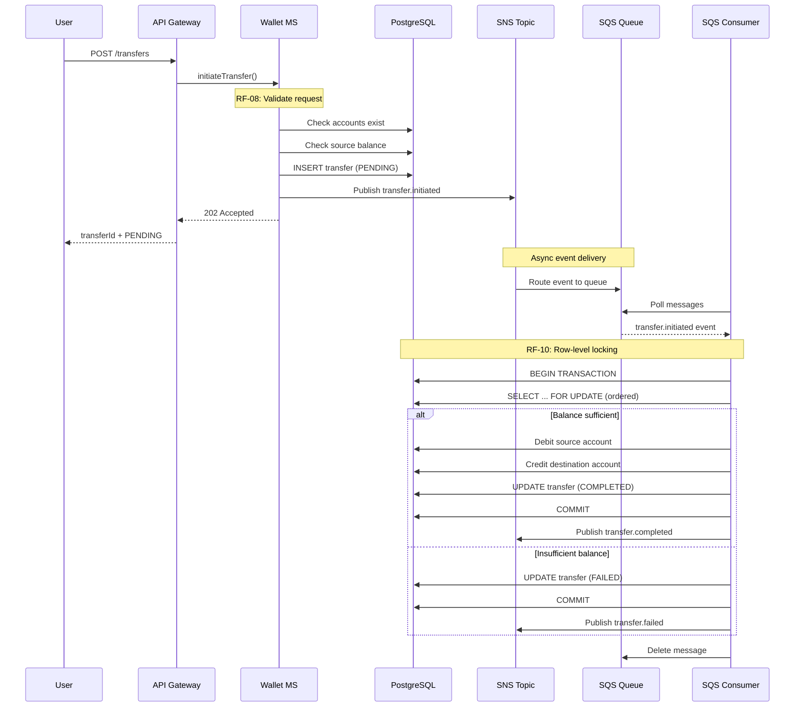

# Transfer Flow - CocoCash Wallet MS

Documentación del flujo de transferencias event-driven.

## Diagrama de Secuencia

## Flujo Paso a Paso

### 1. Iniciación (Síncrono)
- Usuario envía POST /transfers
- **RF-08**: Validación de request (cuentas existen, balance suficiente)
- Crear registro de transfer con status `PENDING`
- **RF-14**: Publicar `transfer.initiated` a SNS
- Retornar 202 Accepted inmediatamente

### 2. Procesamiento (Asíncrono)
- SQS recibe evento de SNS
- Consumer poll con long-polling (20s)
- **RF-10**: Concurrencia y consistencia:
  - `BEGIN TRANSACTION`
  - `SELECT ... FOR UPDATE` (ordenado por ID para evitar deadlocks)
  - Validar balance nuevamente (con lock)
  
### 3. Actualización de Balances
- **RF-11**: 
  - Debitar cuenta origen
  - Acreditar cuenta destino
  - Actualizar status a `COMPLETED`
- `COMMIT TRANSACTION`
- Publicar `transfer.completed`

### 4. Manejo de Errores
- Si balance insuficiente → status `FAILED`
- Si error de sistema → mensaje vuelve a SQS (visibility timeout)
- Después de 3 reintentos → mensaje va a DLQ

## RFs Cubiertos

| RF | Descripción | Componente |
|----|-------------|------------|
| RF-07 | Iniciar transferencia | transfer.controller |
| RF-08 | Validar request | transfer.service |
| RF-09 | Procesamiento async | SQS consumer |
| RF-10 | Concurrencia | SELECT FOR UPDATE |
| RF-11 | Actualizar balances | transfer.service |
| RF-14 | Eventos de dominio | SNS publisher |
